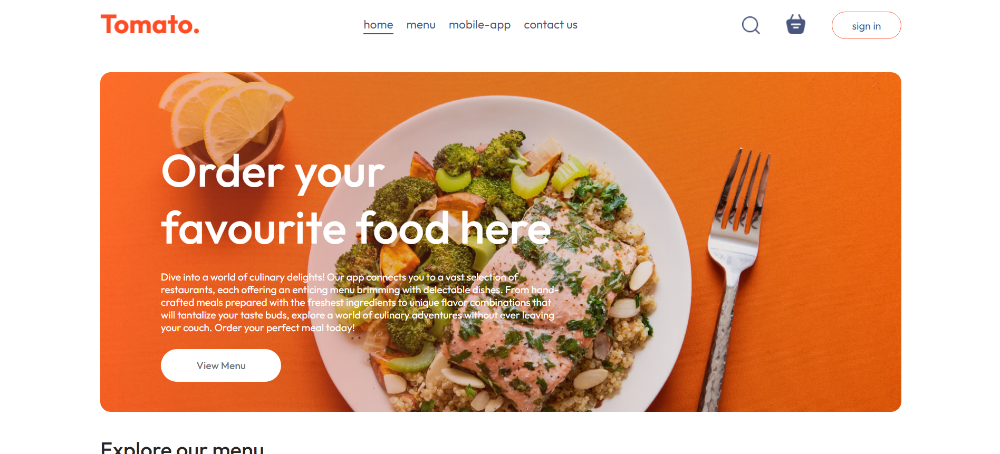

# Food Delivery Application (React.js)

A fully functional food delivery application (Tomato) built with React.js to showcase front-end development skills. Users can browse menus from various cuisines, add items to their cart, and place order for a convenient dining experience.

## Features:
- Browse menus from different cuisines
- Search for specific dishes
- Add items to cart and adjust quantities
- Secure place order process 
- Responsive design

## Technologies Used:
- React.js ⚛️
= React Router
= Vite.js

## Screenshots

## Installation:
Clone this repository:

git clone https://github.com/your-username/food-delivery-app.git

## Install dependencies:

npm install
cd food-delivery-app/client

## Start the deployment server:
npm run dev

Thanks and Stay tuned!
